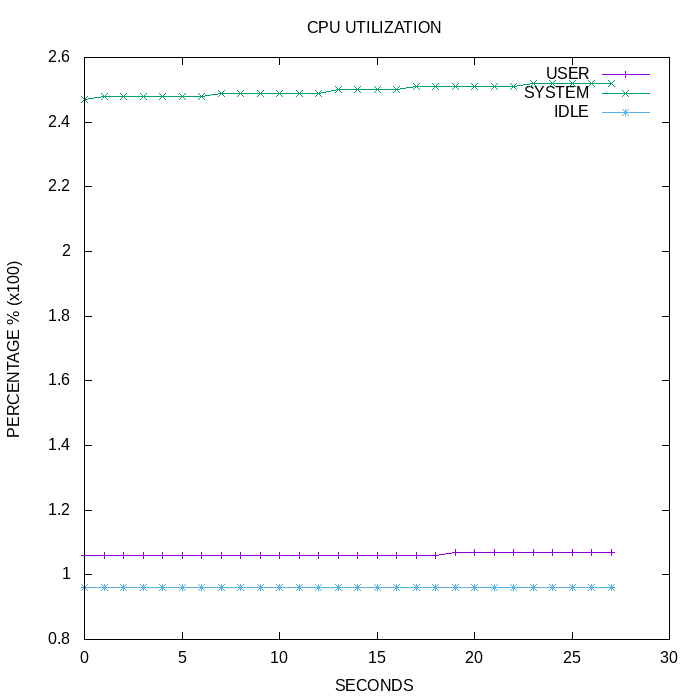
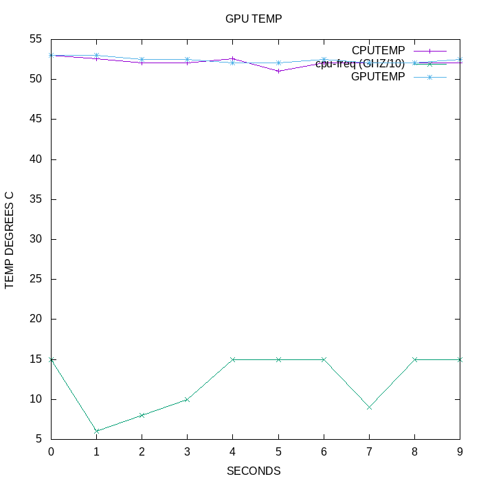
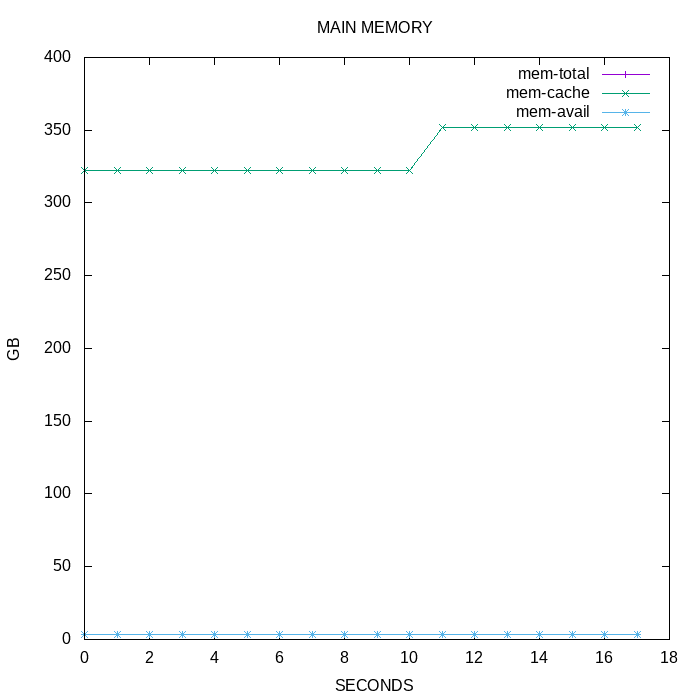
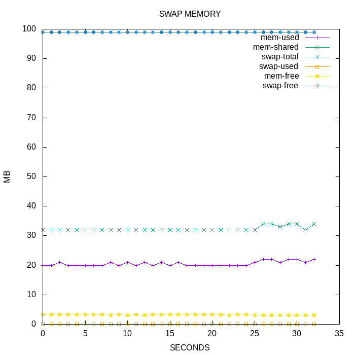

# System Profiler Report

The following report is intended to give the reader insight into the inner workings of their RaspberryPi during the compilation process. 

- Before running the compiler the user should have completed the instructions within INSTRUCTIONS.md up to step 4 in the provided kernel source tree. 

- Then start the profiler script by navigating to this directory and type "./profiler_script&" then press enter. 

- The user should proceed to follow the compilation section of the instructions provided in the archived kernel source tree from step 4. 

- Once compilation is complete the user should kill the profiler using the command instructions that the profiler provides, this will close the profiler and present the results providing this document with graphs displaying system performance information recorded progressively every second. This file can be viewed in a browser by typing "./report" then pressing enter.

#### CPU utilization
The following graph displays the CPU utilization. These these metrcs can be seen to drift relative to eachother as user and system processes work concurrently throughout compilation.

#### CPU Frequency CPU & GPU tempreature
The following graph displays the recorded tempreatures of the CPU compared with that of the GPU. As the workload of the Pi increases it can be seen to generate more heat and the longer it runns the compilation process the more heat accumulates. It can be observed that once a tempreature threshold is reached the RaspberryPi throttles its performance in order to prevent overheating. This in turn restricts performance, however the tempreature can be seen to pleatu. These are contrast by the CPU frequency.

#### Memory Gi
The following graph shows memory statistics that appear within the GigaByte range, this is the main memory and the free memory can be seen to fluctuate significantly throughout the compilation process. 

#### Memory Mi
The following graph shows memory statistics that appear within the MegaByte range, most of these metrics relate to swap memory and remain reasonably stable however free main memory can be seen to deviate dramatically.

