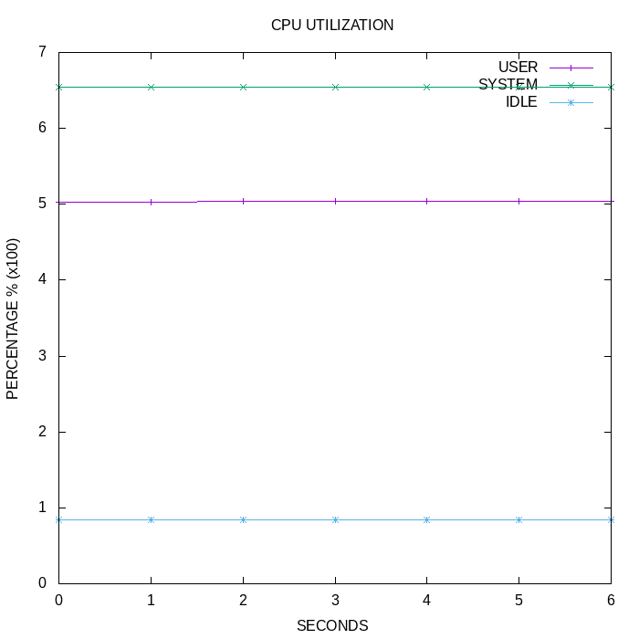
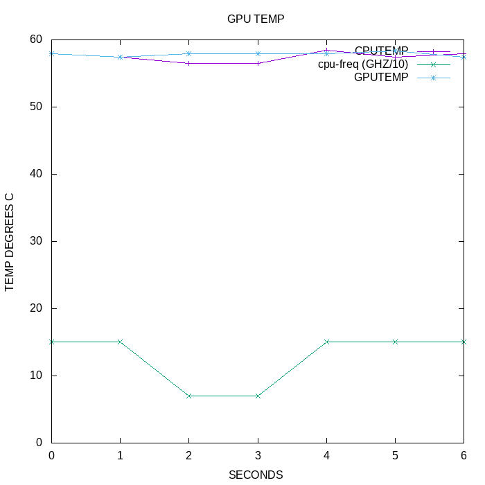
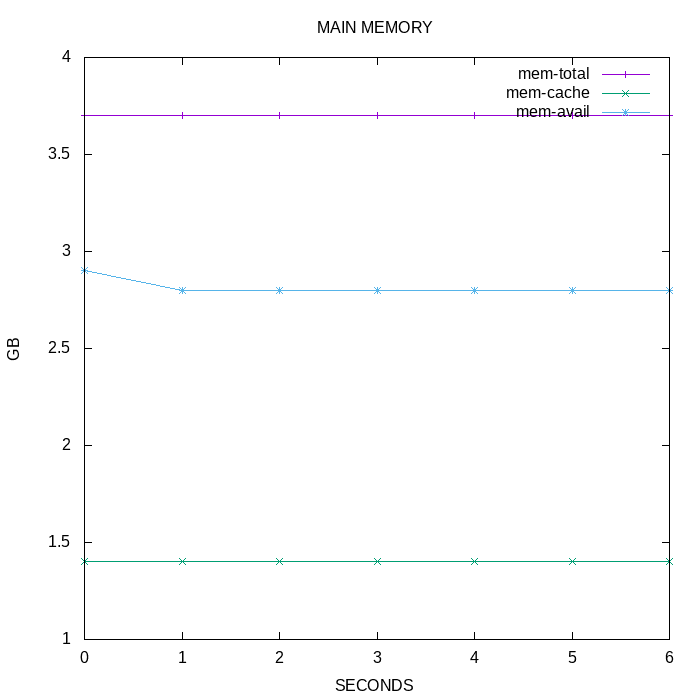
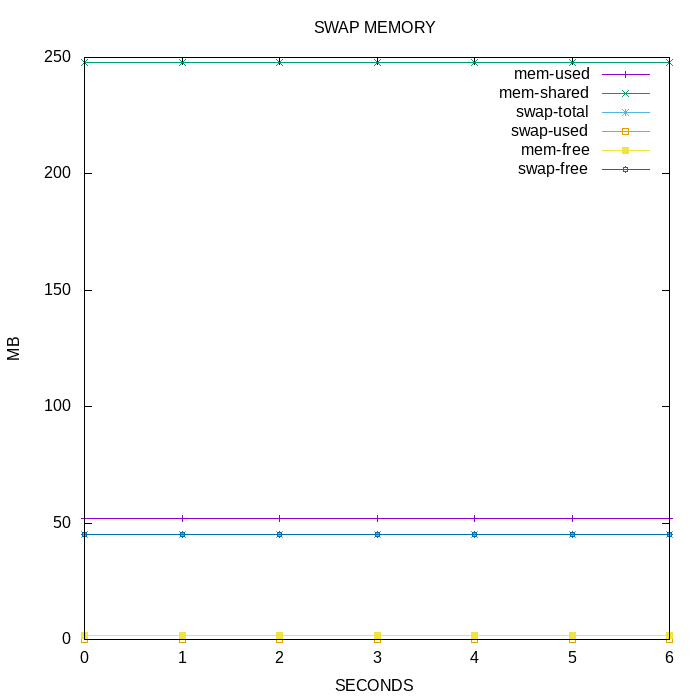

# System Profiler Report

The following report is intended to give the reader insight into the inner workings of their RaspberryPi during the compilation process. 

- This profiler is intended for use during kernel compilation but can be used for gathering metrics on any project.

- If you wish to compile a custom kernel complete the instructions within "INSTRUCTIONS.md" up to step 5 in the provided kernel source tree. 

- Then start the profiler script by navigating to this directory and type "./profiler_script&" then press enter. 

- You should proceed to follow the compilation section of the "IINSTRUCTIONS.md" provided in the archived kernel source tree from step 5. 

- Once compilation is complete the user should kill the profiler using the command instructions that the profiler provides, this will close the profiler and present the results providing this document with graphs displaying system performance information recorded progressively every second. This file can be viewed at any point by typing "./report" in this directory then pressing enter.

#### CPU utilization
The following graph displays the CPU utilization. These these metrcs can be seen to drift relative to eachother. This could be in response to compounding demand throughout compilation. As system processes become more active in repsonse to user applications system demand while the idle capacity remains stable.

#### CPU Frequency CPU & GPU tempreature
The following graph displays the recorded tempreatures of the CPU compared with that of the GPU. 
As the workload of the Pi increases it can be seen to generate more heat and the longer it runns the compilation process the more heat accumulates. 
It can be observed that once a tempreature threshold is reached the RaspberryPi throttles its performance in order to prevent overheating. 
This in turn restricts performance, however the tempreature can be seen to pleatu. These are contrast by the CPU frequency. The gpu and cpu tempreatures can be seen to alternate rapidly.

#### Memory Gi
The following graph shows memory statistics that appear within the GigaByte range, this is best illustrates the cached memoryin relation to the  and the free memory can be seen to fluctuate significantly throughout the compilation process. 

#### Memory Mi
The following graph shows memory statistics that appear within the MegaByte range and mainly represents the swap memory, most of these metrics  remain reasonably stable however swap free does fluctuate dramatically at times which can be assumed is the result of multiple kinds of swap memory being consumed as large files .

																		Thomas Lambert s3632442
                                                                		21/11/21